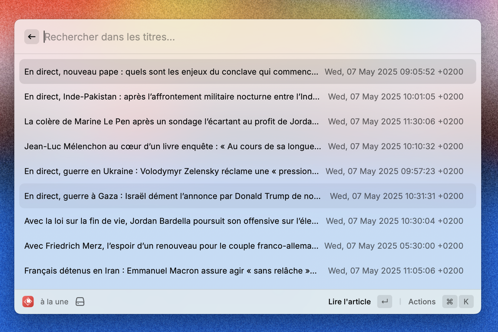
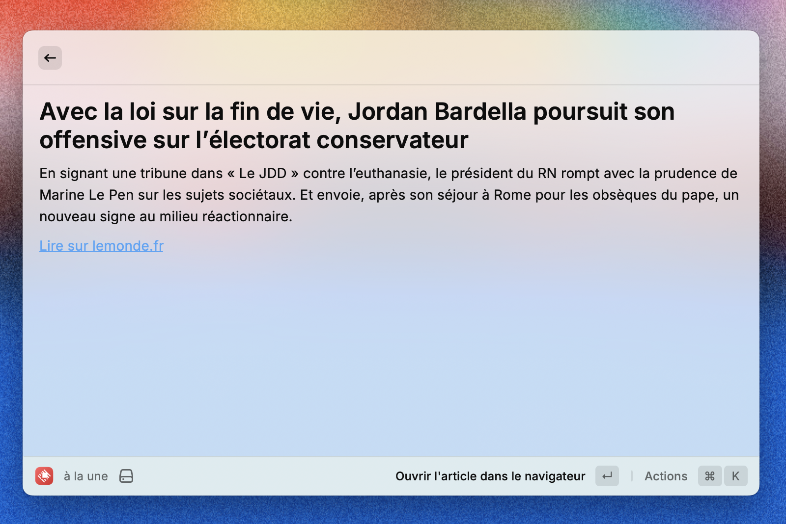

# Le Monde (Raycast Extension)

Consultez les dernières nouvelles de [lemonde.fr](https://www.lemonde.fr) directement depuis Raycast.

## Features

- 📖 Voir les gros titres de la une
- 🔎 Recherche rapide parmi les articles
- ⌘↩️ Ouvrir l'article dans le navigateur
- 👆 Cliquez pour lire dans Raycast en plein écran

## Screenshots

## Install

Disponible bientôt sur le [Raycast Store](https://www.raycast.com/store).

## Author

[uduv](https://github.com/uduv)
